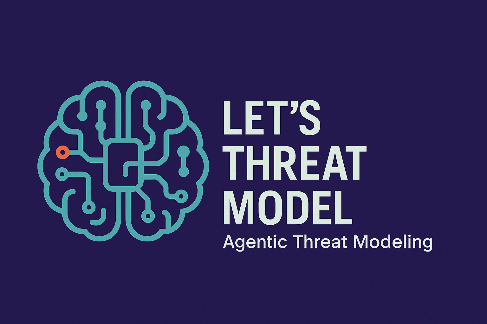

---

layout: col-sidebar
title: OWASP Lets Threat Model
tags: example-tag
level: 2
type: code
pitch: A very brief, one-line description of your project

---

# Let's Threat Model

---

Let's Threat Model is an Agentic AI tool that helps teams identify and manage threats early in the development lifecycle. Built with extensibility and automation in mind, it brings threat modeling into agile workflows by generating actionable threat models.

## 📌 Features
- Parses a **YAML configuration file** containing asset and repository details.
- Uses the configuration to **analyze the specified repository** for potential threats.
- Generates an **Agentic AI-driven threat model report** based on repository structure and metadata.
- Supports output in **Markdown, JSON, and SARIF formats** via command-line flags.
- SARIF output is **compatible with GitHub Code Scanning** and can also be viewed in **IDEs that support SARIF**, such as Visual Studio Code.
- Provides **detailed logging and error handling** for smooth and transparent execution.

